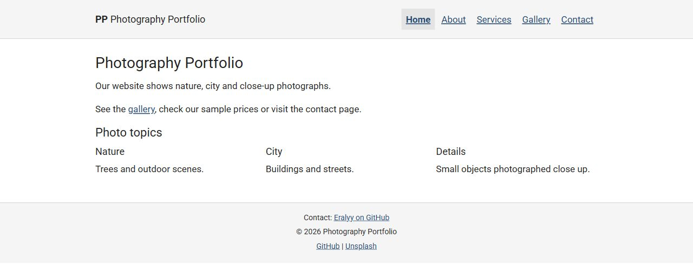
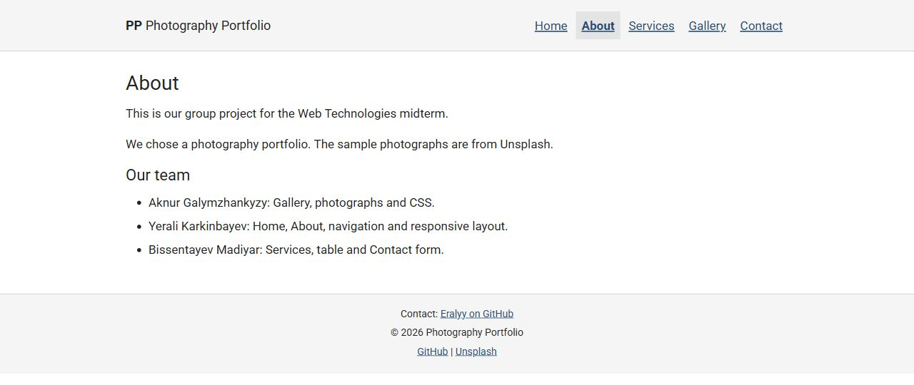
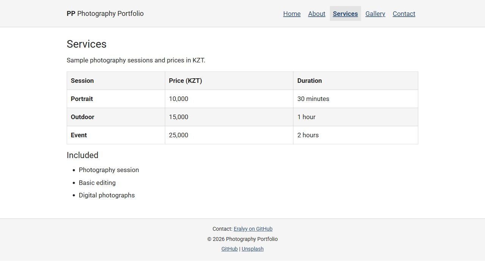
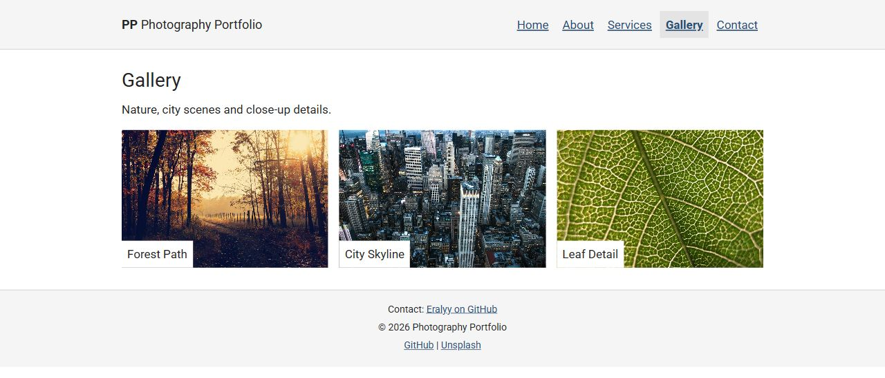
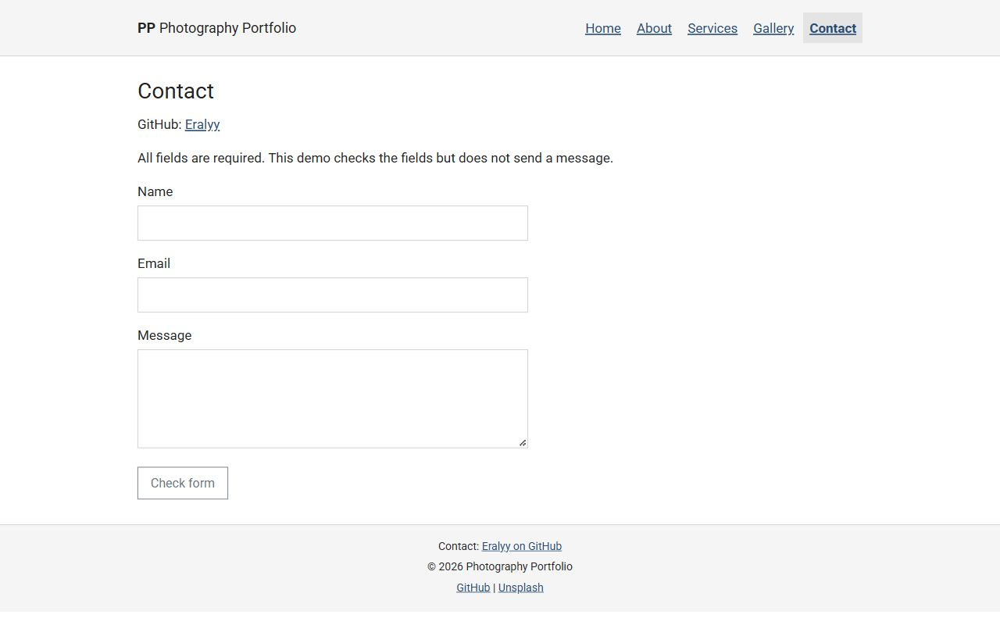

# Photography Portfolio Website

Topic: Photography Portfolio Website.

## Description

A Web Technologies midterm group project. The website presents nature, city and close-up photographs, sample photography services and a contact form.

## Group members and responsibilities

| Member | Project part |
| --- | --- |
| Aknur Galymzhankyzy | Gallery page, photographs, gallery Grid and CSS styling |
| Yerali Karkinbayev | Home and About pages, navigation, Flexbox header and responsive layout |
| Bissentayev Madiyar | Services and Contact pages, pricing table and form |

## Features

- Five connected pages: Home, About, Services, Gallery and Contact.
- Each page has a header with a logo and navigation, a main area and a footer with contact information, copyright and social links.
- Home uses the Bootstrap grid. Gallery uses CSS Grid. Both show one column below 768px, two from 768px and three from 1200px.
- The header uses Flexbox and changes from vertical to horizontal at 768px.
- Gallery photographs have captions, alternative text and lazy loading. Captions use relative and absolute positioning.
- Services has a pricing table with alternating rows using ":nth-child(even)".
- Contact has required name, email and message fields. The browser checks them, but the demo does not send messages.
- External CSS uses classes, an ID, three color variables, and hover and focus styles. Bootstrap classes provide spacing, centered text, containers and a button.

## Technologies

HTML5, CSS3, Bootstrap 5.3.8 and Roboto from Google Fonts. No JavaScript. Sample photographs are from Unsplash.

## Website

[Open the website](https://eralyy.github.io/photography-midterm/)

To open locally, open "index.html" in a browser.

## index.html



## about.html



## services.html



## gallery.html



## contact.html




<details>
<summary>Bootstrap license</summary>

```text
Bootstrap v5.3.8 (https://getbootstrap.com/)

The MIT License (MIT)

Copyright (c) 2011-2025 The Bootstrap Authors

Permission is hereby granted, free of charge, to any person obtaining a copy
of this software and associated documentation files (the "Software"), to deal
in the Software without restriction, including without limitation the rights
to use, copy, modify, merge, publish, distribute, sublicense, and/or sell
copies of the Software, and to permit persons to whom the Software is
furnished to do so, subject to the following conditions:

The above copyright notice and this permission notice shall be included in
all copies or substantial portions of the Software.

THE SOFTWARE IS PROVIDED "AS IS", WITHOUT WARRANTY OF ANY KIND, EXPRESS OR
IMPLIED, INCLUDING BUT NOT LIMITED TO THE WARRANTIES OF MERCHANTABILITY,
FITNESS FOR A PARTICULAR PURPOSE AND NONINFRINGEMENT. IN NO EVENT SHALL THE
AUTHORS OR COPYRIGHT HOLDERS BE LIABLE FOR ANY CLAIM, DAMAGES OR OTHER
LIABILITY, WHETHER IN AN ACTION OF CONTRACT, TORT OR OTHERWISE, ARISING FROM,
OUT OF OR IN CONNECTION WITH THE SOFTWARE OR THE USE OR OTHER DEALINGS IN
THE SOFTWARE.
```

</details>
